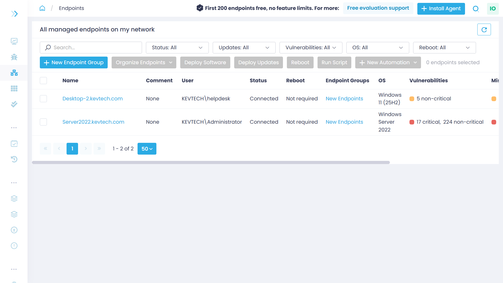
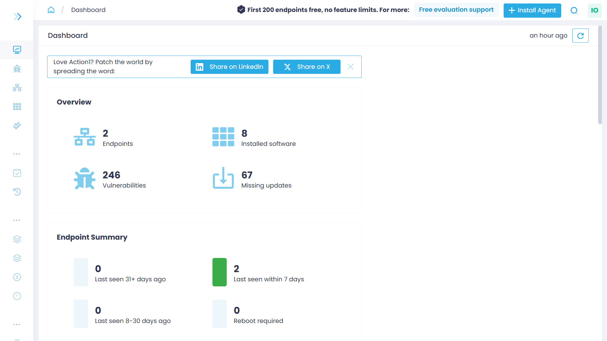
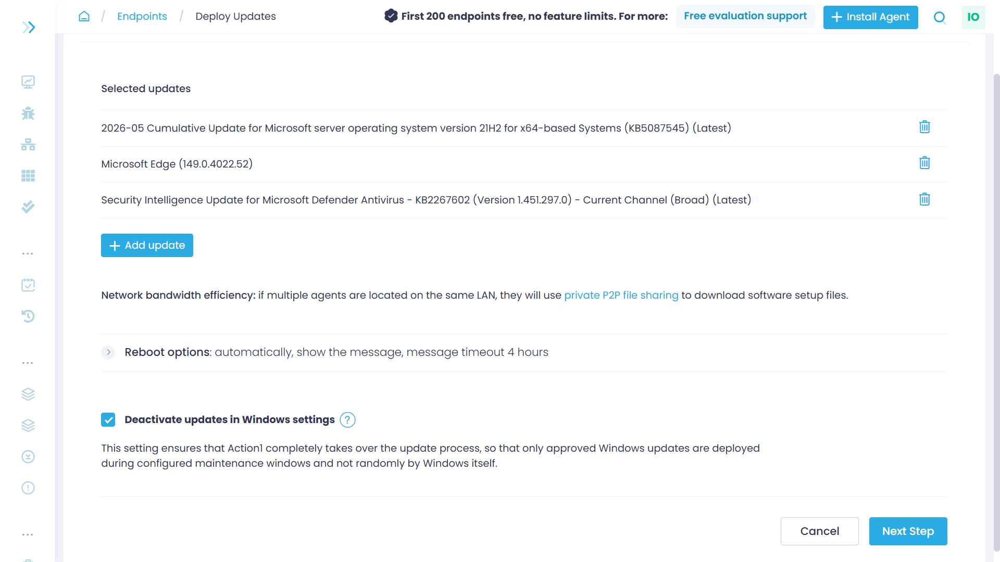
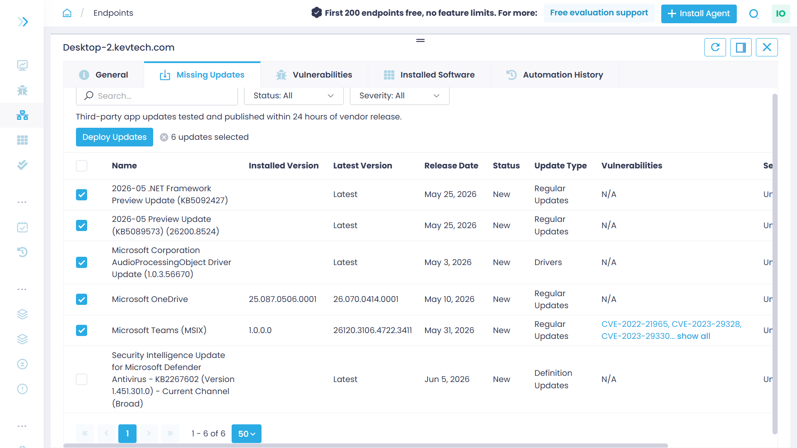
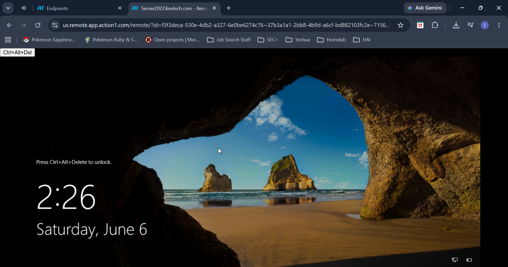

# Endpoint Management

This page is dedidicated to my Action1 endpoint management setup in my lab environment. Action 1 allows me to immediately identify vulnerabilites and install patches/updates. It also provides an option to remotely access all endpoints. 

&ensp;&ensp;&ensp;&ensp;

## Endpoint Dashboard

&ensp;&ensp;&ensp;&ensp;

## Automatic Patch/Updates

Updates on Windows Server

Updates on Windows 11 Client

&ensp;&ensp;&ensp;&ensp;

## Testing remote access functionality

Remote access on Server
