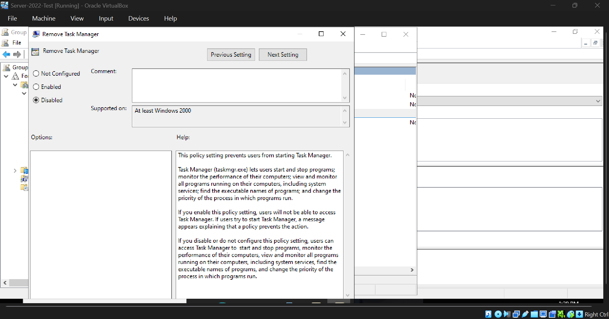
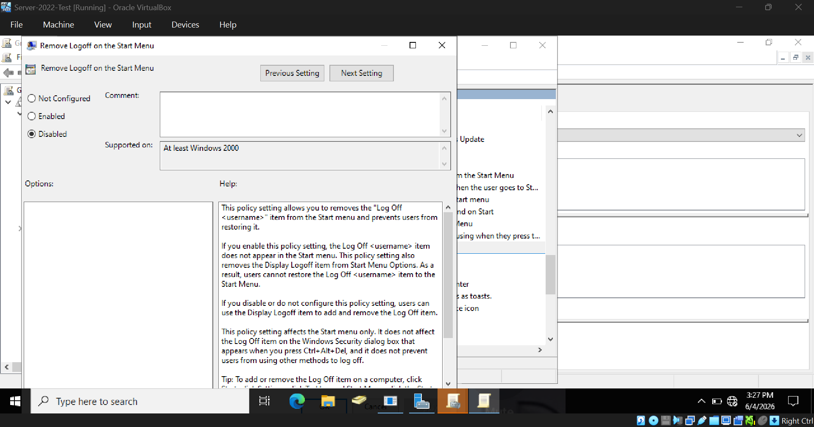
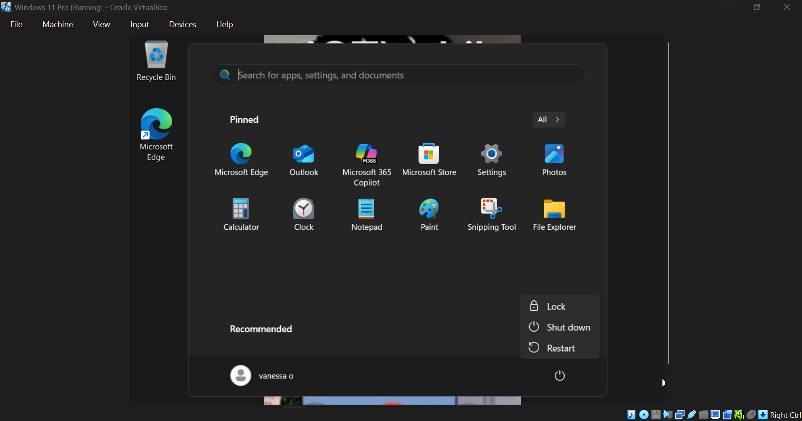
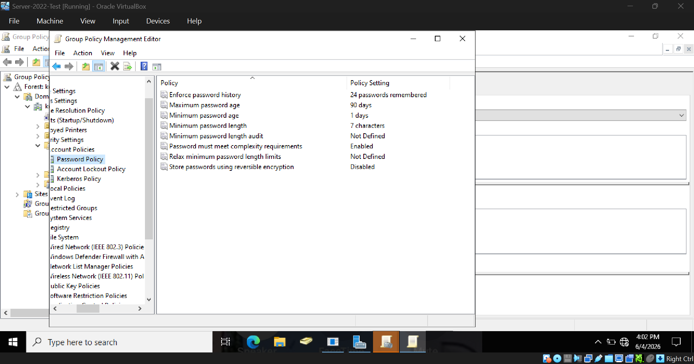
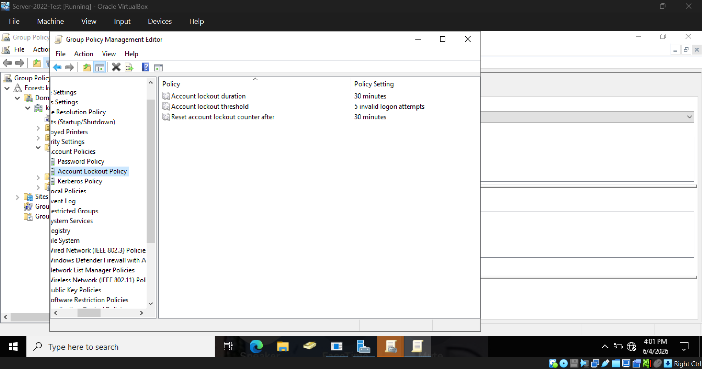
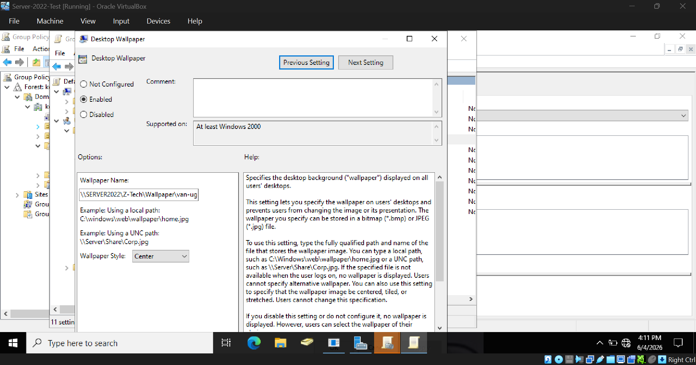
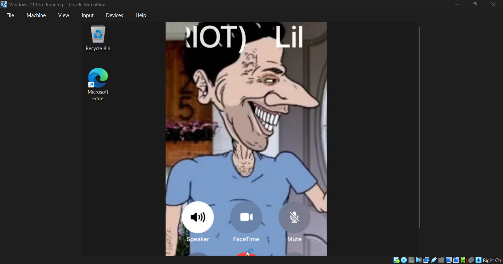

# Group Policy

This page is dedicated to GPO changes that I made during the lab

## Disabling Task Manager

&ensp;&ensp;&ensp;&ensp;

## Disabling Logoff

### Logoff Disabled (Server)

### Logoff Disabled (Client) 

Notice the logoff option is now missing from the menu

&ensp;&ensp;&ensp;&ensp;

## Password Policy + Account Lockout Policy

### Setting Password Policy (Server)

### Setting Lockout Policy (Server)

&ensp;&ensp;&ensp;&ensp;

## Setting universal wallpaper across all computers on domain

### Setting wallpaper policy (Server)

### Universal Wallpaper (Client)

