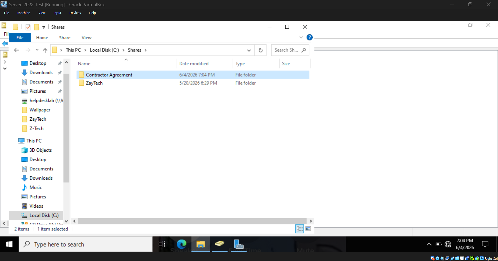
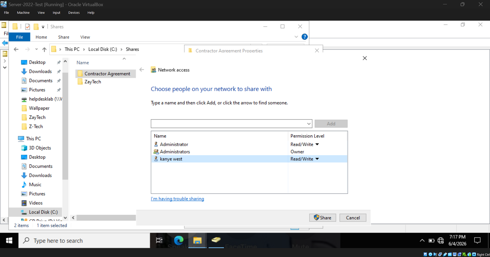
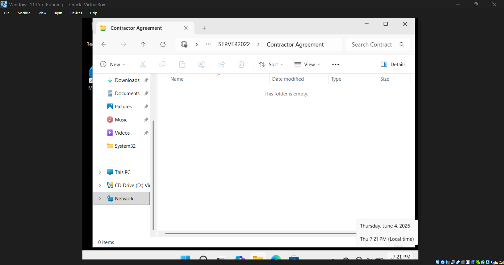
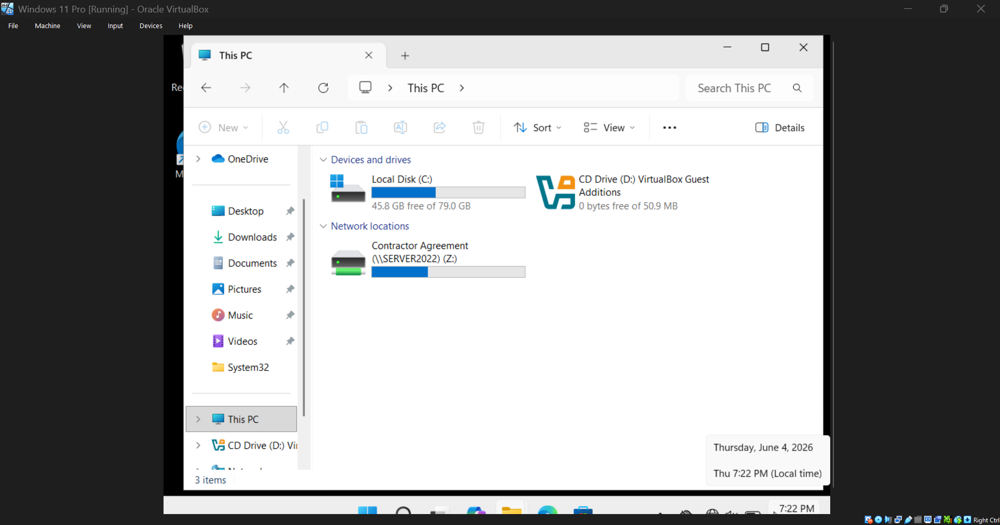

# Shared Drives 

This is examples of excercises involving shared drives that I completed during the lab

&ensp;

## Creating Shared Folder (Server)

&ensp;&ensp;&ensp;&ensp;

## Configuring NTFS Permissions (Server)

&ensp;&ensp;&ensp;&ensp;

## Confirming Access (Client)

&ensp;&ensp;&ensp;&ensp;

## Mapping Network Drive (Client)

