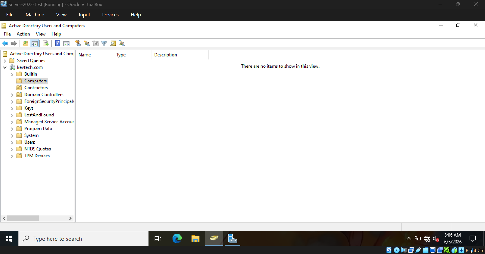
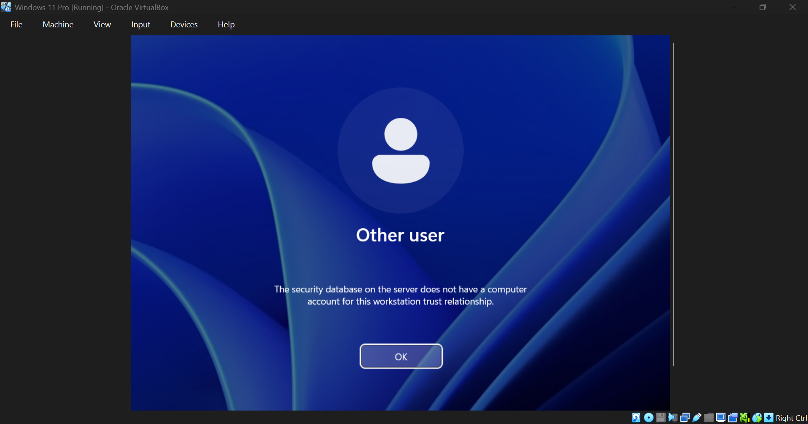
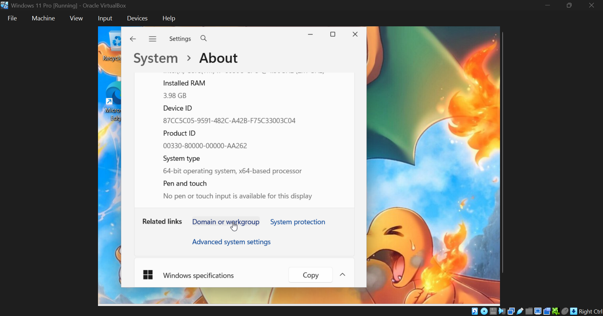
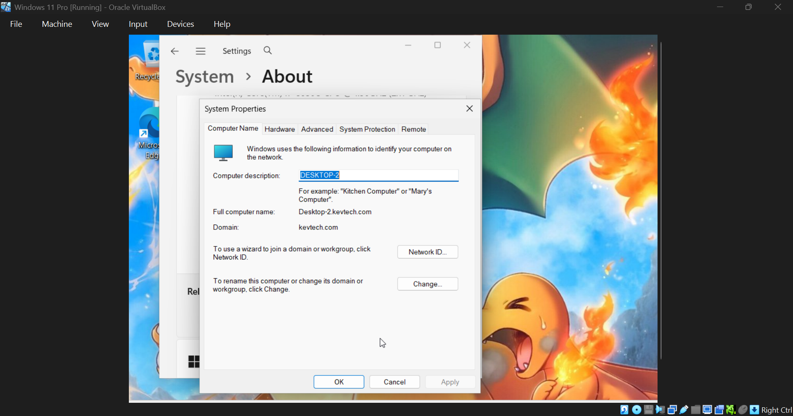

# Troubleshooting Scenarios

## Client Removed from Domain

### Issue

 Client could not log into domain account

### Diagnosis

 Verified machine no longer belonged to domain.

 ### Resolution

 Removed and rejoined domain.

 ### Result 

 Authentication restored

 &ensp;
Notice the client computer is not listed under the domain
 &ensp;

And user cannot log into due to broken trust relationship (computer knocked off from domain)
 &ensp;

Log into admin account on client computer, navigate to System >> About >> Domain and services
 &ensp;

 &ensp;
Type the name of computer to rejoin that computer to domain

 &ensp;&ensp;&ensp;&ensp;

## DNS Resolution Failure

### Issue
`ping kevtech.com` failed

### Diagnosis

Incorrect network adapter configuration. 

### Resolution

Changed client adapter from Bridged to Host-Only.

### Result

Successful domain communication.