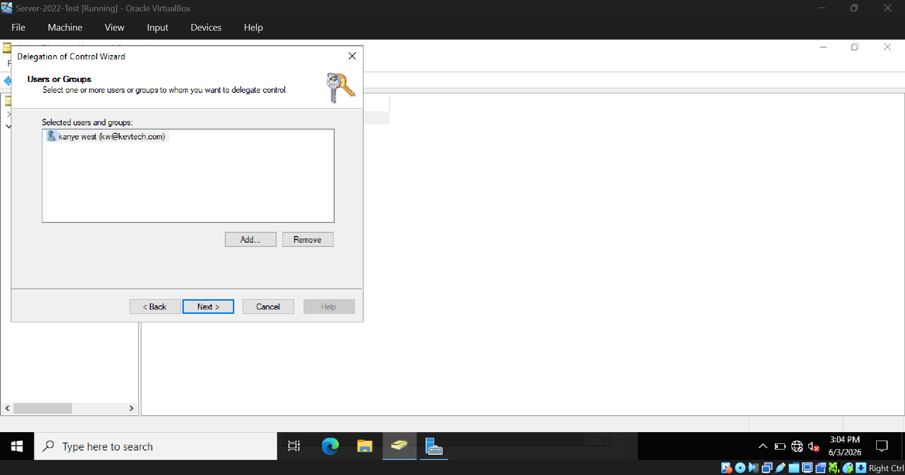
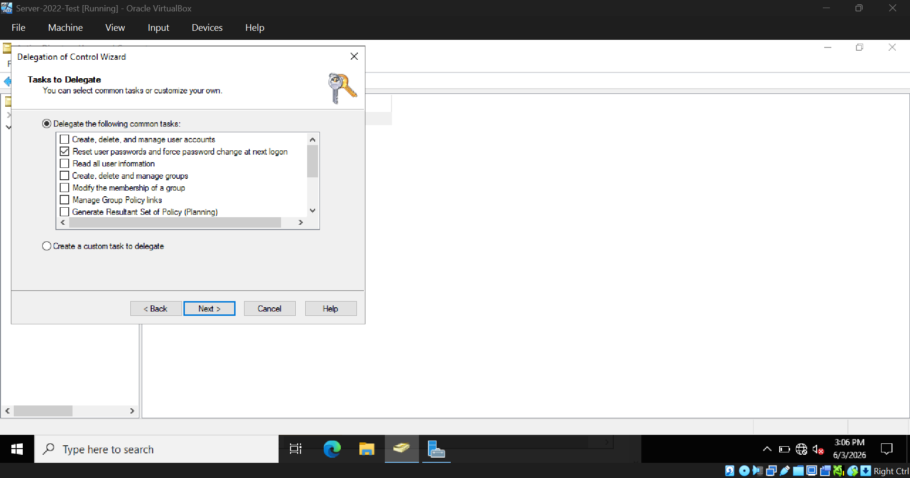
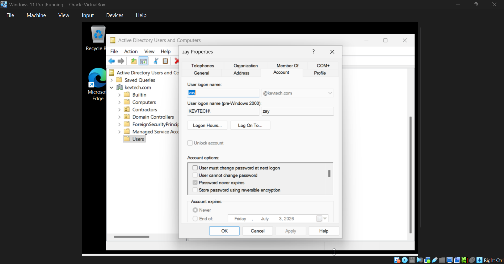
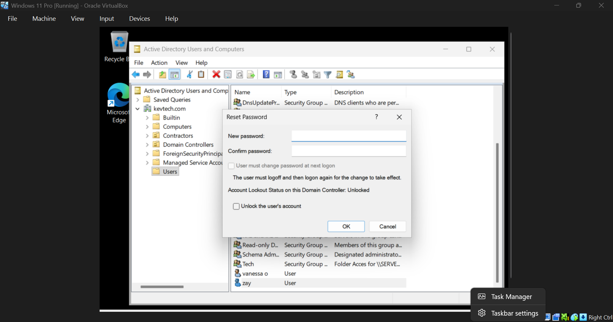
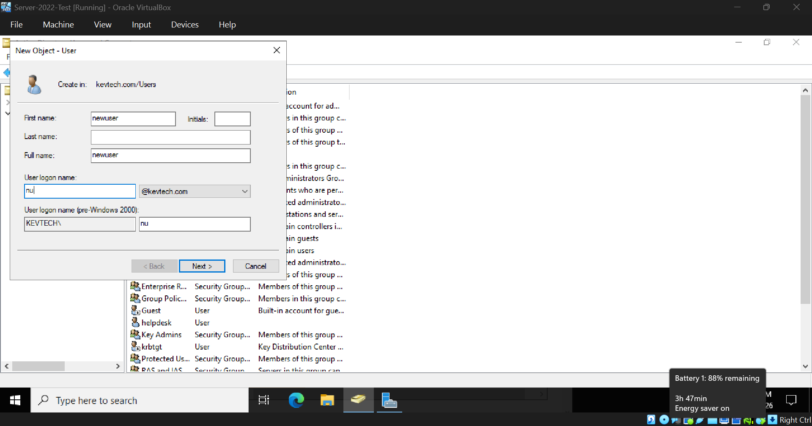
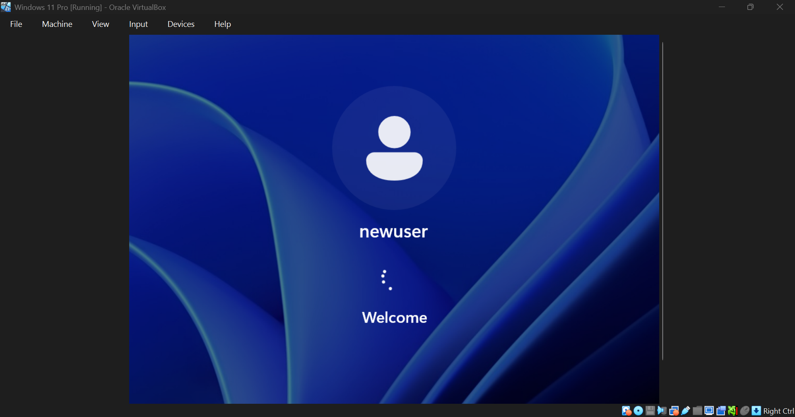
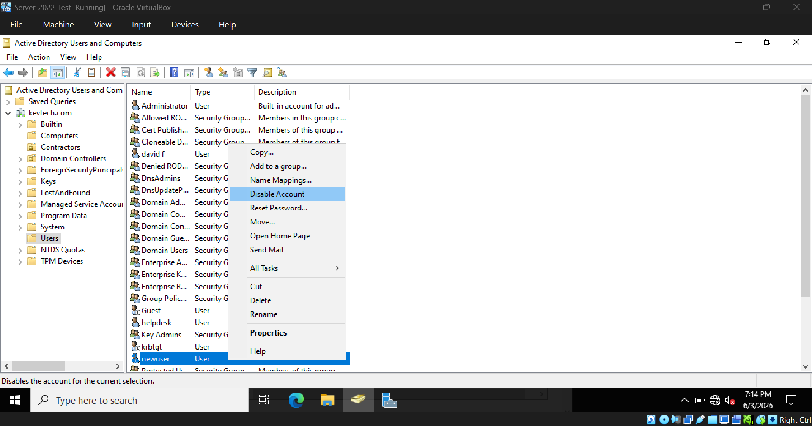
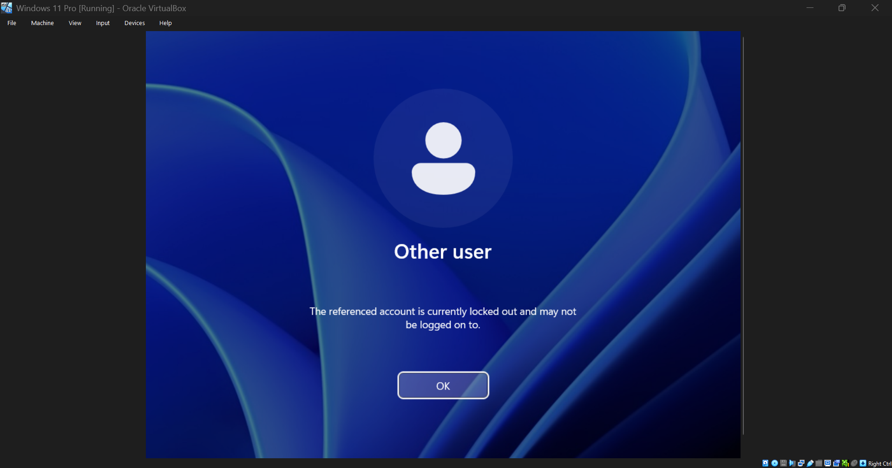
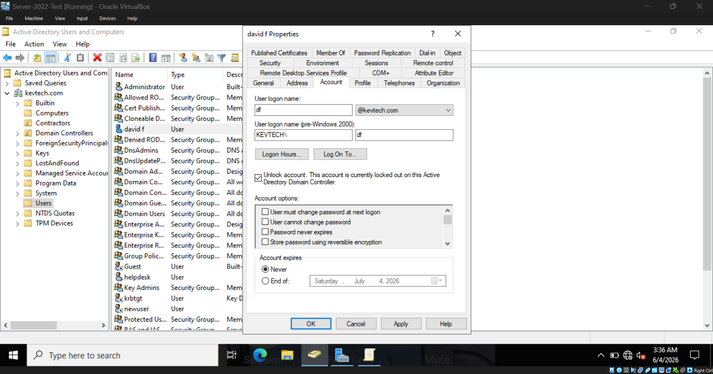
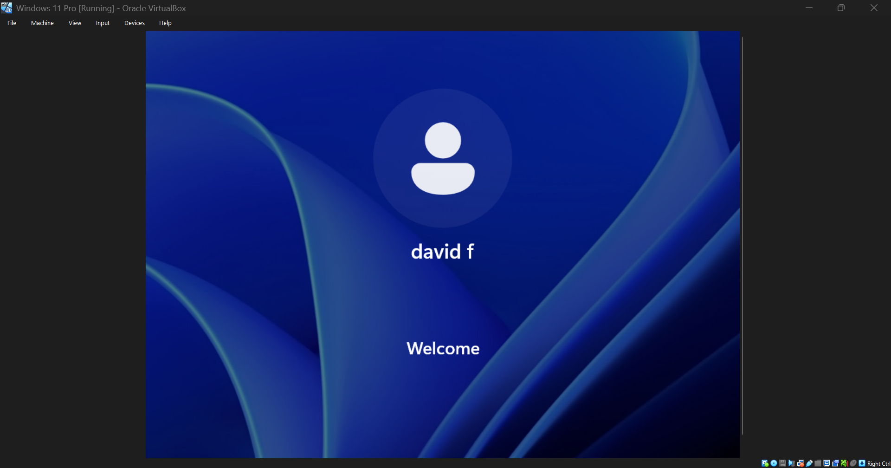

## User Management

This page is dedicated to different excercises I completed throughout the lab to demonstrate user management within an Active Directory environment

&ensp;

## Delegating Control

### Setting Control Permissions (Server)

&ensp;

### Displaying Control Permissions When User Is Logged In (Client)

User "kw@kevtech.com" can only reset passwords, no other function as per control delegated.

&ensp;&ensp;&ensp;&ensp;

## Creating User Accounts 

### Creating a new user account

&ensp;

### Logging into new user account

&ensp;&ensp;&ensp;&ensp;

## Disabling / Enabling Account

### Disabling the account 

### User disabled message

&ensp;&ensp;&ensp;&ensp;

## Account Lockout

## User locked out of account (too many password attempts)

## Unlocking User Account

